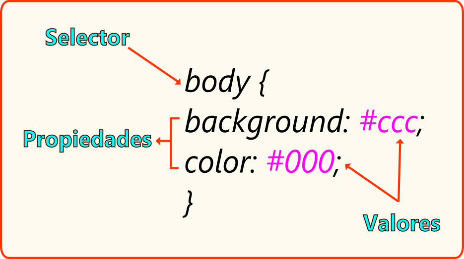
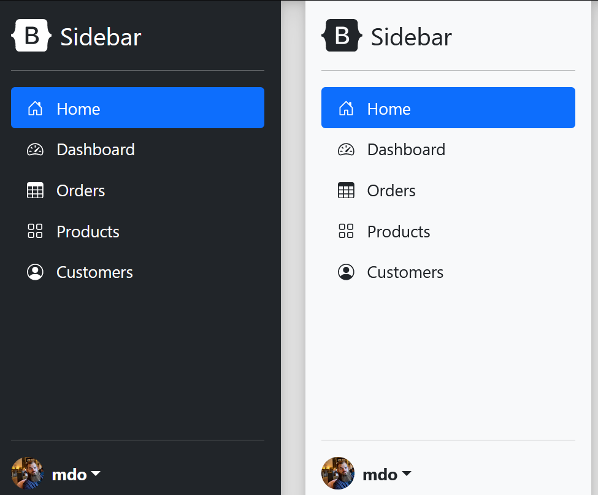
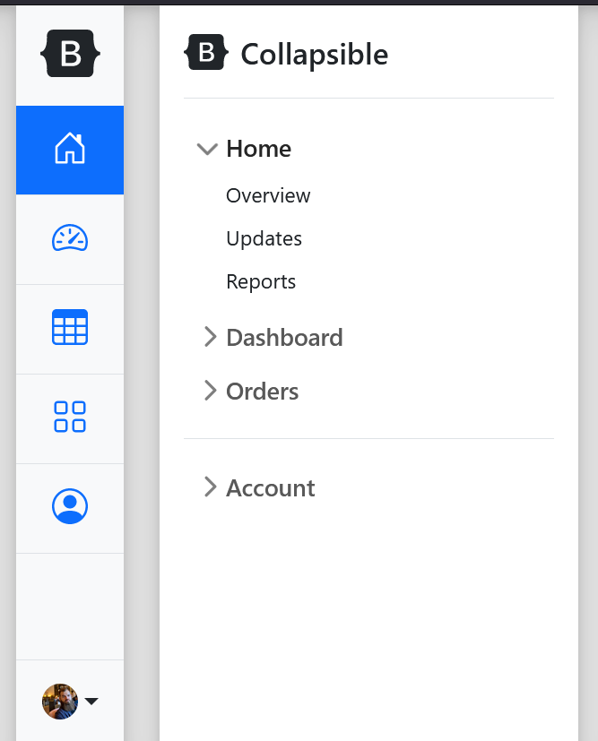

## GUIA DE LABORATORIO N° 2
>Intitución                 |Universidad Nacional del Centro del Perú   |
>-------------------------  | ------------------------------            |
>**Programa de Estudios:**  | Ingeniería de Sistemas                    |
>**Asignatura:**            | Desarrollo de Aplicaciones Web            |
>**Docente:**               | Jaime Suasnábar Terrel                    |
>**Semestre:**              | IX                                        |

### I. OBJETIVO
Usar HTML y CSS para diseñar elementos utilizables en la web y para desarrollar componentes de una página web.

### II. FUNDAMENTO TEÓRICO
#### Cascading Style Sheets
CSS describe cómo se deben mostrar los elementos HTML en la pantalla.

#### Sintaxis


#### Selectores
**Selector Básicos**
```css
div {
    // Aplica a elementos div.
}
.example {
    // Aplica a elementos con la clase 'example’.
}
#example {
// Aplica al elemento con el id 'example’.
}
* {
// Aplica a todos los elementos.
}
[attr] {
// Aplica a todos los elementos con ese atributo.
}
```
**Selector Avanzados**
```css
h1 + p {
// Aplica a p hermanos adyacentes.
}
h1 ~ p {
    // Combinador general de hermanos
    // Aplica a los p con un hermano h1 que les precede.
}
div > p {
// Aplica al hijo p de un div. (combinador de hijos)
}
div li {
// Aplica a li de un div, (combinador de decendientes indirectos)
}

```
#### Guía de referencia CSS
[Referencia CSS](https://developer.mozilla.org/en-US/docs/Web/CSS/Reference 
)
### III. EJERCICIOS DEL LABORATORIO
#### Ejercicio 2.1
Diseñar botones interactivos similar a boostrap utilizando las clases btn success info etc.

```html
<button class="btn success">Success</button>
<button class="btn info">Info</button>
<button class="btn warning">Warning</button>
<button class="btn danger">Danger</button>
<button class="btn default">Default</button>
```
```css
.btn {
  border: none; /* Remove borders */
  color: white; /* Add a text color */
  padding: 14px 28px; /* Add some padding */
  cursor: pointer; /* Add a pointer cursor on mouse-over */
}
/* Green */
.success {background-color: #04AA6D;} 
.success:hover {background-color: #46a049;}
 /* Blue */
.info {background-color: #2196F3;}
.info:hover {background: #0b7dda;}
/* Orange */
.warning {background-color: #ff9800;} 
.warning:hover {background: #e68a00;}
/* Red */
.danger {background-color: #f44336;} 
.danger:hover {background: #da190b;}
/* Gray */
.default {background-color: #e7e7e7; color: black;} 
.default:hover {background: #ddd;}
```
#### Ejercicio 2.2
Diseñar botones interactivos para redes sociales utilizando clases (fa fa-facebook etc) y caracteres similar a font-awesome. Utilizar iconos de: 
[fontawesome](https://cdnjs.cloudflare.com/ajax/libs/font-awesome/4.7.0/css/font-awesome.min.css)
```html
<!DOCTYPE html>
<html>
<head>
<meta name="viewport" content="width=device-width, initial-scale=1">
<link rel="stylesheet" href="https://cdnjs.cloudflare.com/ajax/libs/font-awesome/4.7.0/css/font-awesome.min.css">

</head>
<body>

<h2>Estilos para Botones de Redes Soociales</h2>

<!-- Botones de redes sociales -->
<a href="#" class="fa fa-facebook"></a>
<a href="#" class="fa fa-twitter"></a>
<a href="#" class="fa fa-google"></a>
<a href="#" class="fa fa-linkedin"></a>
<a href="#" class="fa fa-youtube"></a>
<a href="#" class="fa fa-instagram"></a>
<a href="#" class="fa fa-pinterest"></a>
<a href="#" class="fa fa-snapchat-ghost"></a>
<a href="#" class="fa fa-skype"></a>
<a href="#" class="fa fa-android"></a>
<a href="#" class="fa fa-dribbble"></a>
<a href="#" class="fa fa-vimeo"></a>
<a href="#" class="fa fa-tumblr"></a>
<a href="#" class="fa fa-vine"></a>
<a href="#" class="fa fa-foursquare"></a>
<a href="#" class="fa fa-stumbleupon"></a>
<a href="#" class="fa fa-flickr"></a>
<a href="#" class="fa fa-yahoo"></a>
<a href="#" class="fa fa-reddit"></a>
<a href="#" class="fa fa-rss"></a>
      
</body>
</html> 

```
```css
.fa {
  padding: 20px;
  font-size: 30px;
  width: 50px;
  text-align: center;
  text-decoration: none;
  margin: 5px 2px;
}
.fa:hover {
    opacity: 0.7;
}

.fa-facebook {
  background: #3B5998;
  color: white;
}
.fa-twitter {
  background: #55ACEE;
  color: white;
}
.fa-google {
  background: #dd4b39;
  color: white;
}
.fa-linkedin {
  background: #007bb5;
  color: white;
}
.fa-youtube {
  background: #bb0000;
  color: white;
}
.fa-instagram {
  background: #125688;
  color: white;
}
.fa-pinterest {
  background: #cb2027;
  color: white;
}
.fa-snapchat-ghost {
  background: #fffc00;
  color: white;
  text-shadow: -1px 0 black, 0 1px black, 1px 0 black, 0 -1px black;
}
.fa-skype {
  background: #00aff0;
  color: white;
}
.fa-android {
  background: #a4c639;
  color: white;
}
.fa-dribbble {
  background: #ea4c89;
  color: white;
}
.fa-vimeo {
  background: #45bbff;
  color: white;
}
.fa-tumblr {
  background: #2c4762;
  color: white;
}
.fa-vine {
  background: #00b489;
  color: white;
}
.fa-foursquare {
  background: #45bbff;
  color: white;
}
.fa-stumbleupon {
  background: #eb4924;
  color: white;
}
.fa-flickr {
  background: #f40083;
  color: white;
}
.fa-yahoo {
  background: #430297;
  color: white;
}
.fa-soundcloud {
  background: #ff5500;
  color: white;
}
.fa-reddit {
  background: #ff5700;
  color: white;
}
.fa-rss {
  background: #ff6600;
  color: white;
}
```

#### Ejercicio 2.3
Diseñar un loader (animación de precarga) como un anillo que gira con animación infinita. 
```html
<div class="loader"></div>
```
```css
.loader {
  border: 16px solid #f3f3f3; /* Light grey */
  border-top: 16px solid #3498db; /* Blue */
  border-radius: 50%;
  width: 120px;
  height: 120px;
  animation: spin 2s linear infinite;
}

@keyframes spin {
  0% { transform: rotate(0deg); }
  100% { transform: rotate(360deg); }
}
```
#### Ejercicio 2.4
Diseñar La estructua de página responsiva
```html
<!DOCTYPE html>
<html>
<head>
    <meta name="viewport" content="width=device-width, initial-scale=1.0">
</head>
<body>

<div class="header">
  <h1>Chania</h1>
</div>

<div class="row">
  <div class="col-3 col-s-3 menu">
    <ul>
      <li>The Flight</li>
      <li>The City</li>
      <li>The Island</li>
      <li>The Food</li>
    </ul>
  </div>

  <div class="col-6 col-s-9">
    <h1>The City</h1>
    <p>Chania is the capital of the Chania region on the island of Crete. The city can be divided in two parts, the old town and the modern city.</p>
  </div>

  <div class="col-3 col-s-12">
    <div class="aside">
      <h2>What?</h2>
      <p>Chania is a city on the island of Crete.</p>
      <h2>Where?</h2>
      <p>Crete is a Greek island in the Mediterranean Sea.</p>
      <h2>How?</h2>
      <p>You can reach Chania airport from all over Europe.</p>
    </div>
  </div>
</div>

<div class="footer">
  <p>Resize the browser window to see how the content respond to the resizing.</p>
</div>

</body>
</html>
```

```css
* {
  box-sizing: border-box;
}

.row::after {
  content: "";
  clear: both;
  display: table;
}

[class*="col-"] {
  float: left;
  padding: 15px;
}

html {
  font-family: "Lucida Sans", sans-serif;
}

.header {
  background-color: #9933cc;
  color: #ffffff;
  padding: 15px;
}

.menu ul {
  list-style-type: none;
  margin: 0;
  padding: 0;
}

.menu li {
  padding: 8px;
  margin-bottom: 7px;
  background-color: #33b5e5;
  color: #ffffff;
  box-shadow: 0 1px 3px rgba(0,0,0,0.12), 0 1px 2px rgba(0,0,0,0.24);
}

.menu li:hover {
  background-color: #0099cc;
}

.aside {
  background-color: #33b5e5;
  padding: 15px;
  color: #ffffff;
  text-align: center;
  font-size: 14px;
  box-shadow: 0 1px 3px rgba(0,0,0,0.12), 0 1px 2px rgba(0,0,0,0.24);
}

.footer {
  background-color: #0099cc;
  color: #ffffff;
  text-align: center;
  font-size: 12px;
  padding: 15px;
}

/* For mobile phones: */
[class*="col-"] {
  width: 100%;
}

@media only screen and (min-width: 600px) {
  /* For tablets: */
  .col-s-1 {width: 8.33%;}
  .col-s-2 {width: 16.66%;}
  .col-s-3 {width: 25%;}
  .col-s-4 {width: 33.33%;}
  .col-s-5 {width: 41.66%;}
  .col-s-6 {width: 50%;}
  .col-s-7 {width: 58.33%;}
  .col-s-8 {width: 66.66%;}
  .col-s-9 {width: 75%;}
  .col-s-10 {width: 83.33%;}
  .col-s-11 {width: 91.66%;}
  .col-s-12 {width: 100%;}
}
@media only screen and (min-width: 768px) {
  /* For desktop: */
  .col-1 {width: 8.33%;}
  .col-2 {width: 16.66%;}
  .col-3 {width: 25%;}
  .col-4 {width: 33.33%;}
  .col-5 {width: 41.66%;}
  .col-6 {width: 50%;}
  .col-7 {width: 58.33%;}
  .col-8 {width: 66.66%;}
  .col-9 {width: 75%;}
  .col-10 {width: 83.33%;}
  .col-11 {width: 91.66%;}
  .col-12 {width: 100%;}
}
```
#### Ejercicio 2.5
Desarrollar una página web sólo usando html y CSS que contenga un sidebar con 2 modos de visualización: claro y oscuro. Agregar un botón para cambiar el modo.



#### Ejercicio 2.6
Desarrollar una página web sólo usando html y CSS que contenga un sidebar con 2 modos de visualización: contraido y expandidos. Agregar un botón para cambiar el modo.



### IV. RESULTADOS
Los resultados serán publicados en el portafolio electrónico del estudiante.