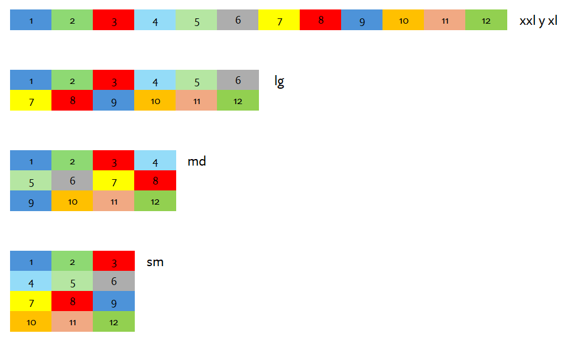

## 
GUIA DE LABORATORIO N° 3

>Intitución                 |Universidad Nacional del Centro del Perú   |
>-------------------------  | ------------------------------            |
>**Programa de Estudios:**  | Ingeniería de Sistemas                    |
>**Asignatura:**            | Desarrollo de Aplicaciones Web            |
>**Docente:**               | Jaime Suasnábar Terrel                    |
>**Semestre:**              | IX                                        |
### I. OBJETIVO
Usar y personalizar librerías de código CSS para el diseño responsive y para el diseño de componentes de una página web.

### II. FUNDAMENTO TEÓRICO
#### Frameworks CSS
Un framework de CSS es una biblioteca de estilos genéricos que puede ser usada para implementar diseños web. Aportan una serie de utilidades y componentes. 
#### Bootstrap CSS
Bootstrap es una biblioteca multiplataforma o conjunto de herramientas de código abierto para diseño de sitios y aplicaciones web. Contiene plantillas de diseño con tipografía, formularios, botones, cuadros, menús de navegación y otros elementos de diseño basado en HTML y CSS. 

#### Guía de referencia Bootstrap CSS
[Referencia BootStrap](https://getbootstrap.com/docs/5.0/getting-started/introduction/)
### III. EJERCICIOS DEL LABORATORIO
#### Ejercicio 3.1
Diseñar una pagina web responsive con Bootstrap que contenga una fila y 12 columnas para pantallas sm, md, lg, xl y xxl. Segun la siguiente figura.

### Ejercicio 3.2
Desarrollar el ejercicio 3.1 con Tailwind

### Ejercicio 3.3
Desarrollar el ejercicio 3.1 con CSS puro

### Ejercicio 3.4
Diseñar una pagina web responsive con Bootstrap que contenga un diseño según la plantilla [
[Plantilla BootStrap](https://www.eplantillasweb.com/live/#tmpl_id=61389&url_preview=https://ld-wt73.template-help.com/wt_prod-28727/). Las características de la página deberá tener el mismo contenido texto e imagenes. Así también la misma distribución, colores, diseño, animación para pantallas sm, md, lg, xl y xxl. Segun la siguiente figura.

### Ejercicio 3.5
Desarrollar el ejercicio 3.4 con Tailwind

### Ejercicio 3.6
Desarrollar el ejercicio 3.4 con CSS puro

### IV. RESULTADOS
Los resultados serán publicados en el portafolio electrónico del estudiante.