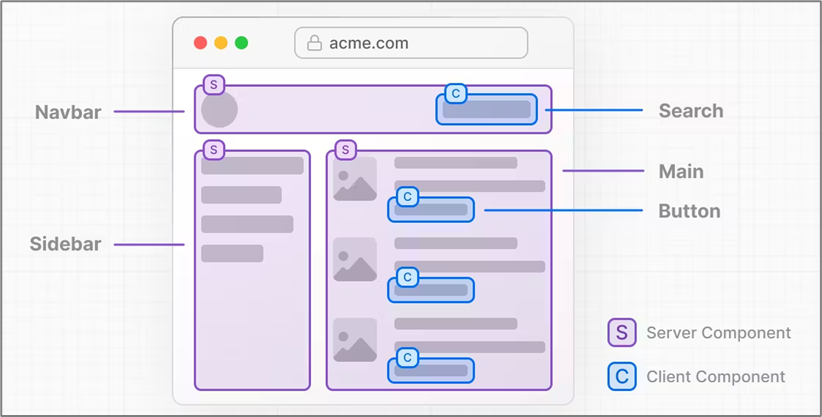
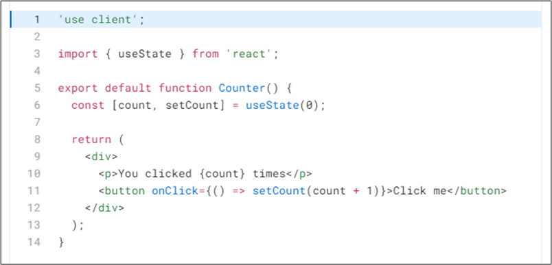
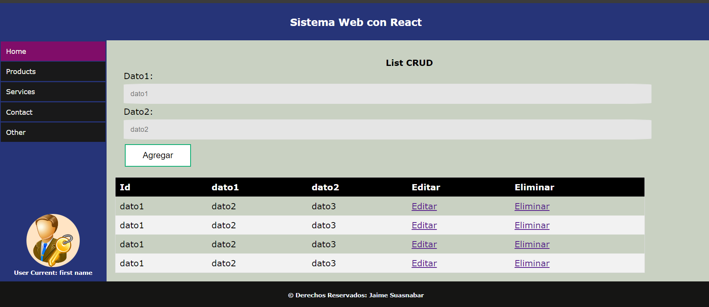

## <center>GUIA DE LABORATORIO N° 11<center>
>Intitución                 |Universidad Nacional del Centro del Perú   |
>-------------------------  | ------------------------------            |
>**Programa de Estudios:**  | Ingeniería de Sistemas                    |
>**Asignatura:**            | Desarrollo de Aplicaciones Web            |
>**Docente:**               | Jaime Suasnábar Terrel                    |
>**Semestre:**              | IX                                        |
### I. OBJETIVO
Desarrollar aplicaciones dinámicas con Next JS.

### II. FUNDAMENTO TEÓRICO
#### Rendering y Server Side Rendering
Proceso de convertir el código generado en JavaScript y CSS (Components React) en HTML(s) y su interfaz de usuario. Incluye el proceso de desempaquetar el JavaScript. 
*	El renderizado puede ser en el servidor o en el cliente. 
*	En tiempo de compilación (build time) o en tiempo de ejecución (run time).
El Server Side Rendering es un renderizado de una aplicación (SPA) en el servidor y enviado al cliente

#### Next JS
Next es un framework fullstack JavaScript, que emplea React para crear componentes. Y no solo componentes de frontend. Gracias a los "React Server Components (RSC)" podemos tener componentes del lado servidor o backend. 
Con Next.js, están disponibles tres tipos de métodos de renderizado: 
*	Server-Side Rendering (Pre renderizado)
*	Static Site Generation (Pre renderizado)
*	Client-Side Rendering.

#### Pensando en Componentes de Servidor
React Server Components representa un nuevo modelo mental para crear aplicaciones híbridas que aprovechan el servidor y el cliente.

En lugar de que React represente toda su aplicación del lado del cliente (como en el caso de las aplicaciones de una sola página SPA), NextJS ahora le brinda la flexibilidad de elegir dónde presentar sus componentes en función de su propósito.



Si dividimos la página en componentes pequeños, notará que la mayoría de los componentes no son interactivos y se debe representar como componentes del servidor. Para piezas más pequeñas de interfaz de usuario interactiva, se debe agregar componentes de cliente.

#### ¿Por qué componentes de servidor?
Los componentes del servidor permiten a los desarrolladores aprovechar mejor la infraestructura del servidor. Por ejemplo, puede mover la obtención de datos al servidor, más cerca de su base de datos, y mantener dependencias grandes que anteriormente afectarían el tamaño del paquete de JavaScript del cliente en el servidor, lo que lleva a un mejor rendimiento. 
Con Server Components, la carga de la página inicial es más rápida y el tamaño del paquete de JavaScript del lado del cliente se reduce. El tiempo de ejecución base del lado del cliente es almacenable en caché y de tamaño predecible , y no aumenta a medida que crece su aplicación.
Los componentes dentro de App Router son componentes del servidor de forma predeterminada, incluidos los archivos especiales y los componentes colocados. 
#### Componentes del cliente
La directiva <code>"use client"</code> que el componente se renderiza en el cliente.


#### Typescript
TypeScript es un lenguaje de programación libre y de código abierto desarrollado por Microsoft. Es un JavaScript, que esencialmente añade tipado estático y objetos basados en clases.

#### Tipos de variables y datos
En TypeScript las variables se declaran igual que en Javascript, pero se especifica que tipo de dato es, por ejemplo:
```js
// Dato de tipo string
var name: string = 'Tu nombre';
name = 'Otro nombre'; // Es correcto
name = 2 // Es incorrecto

// Dato de tipo number
var age: number = 29;
age = 0xf00d; // Es hexadecimal y es correcto
age = '3'; // Es un string e incorrecto

// Dato de tipo boolean
var havePets: boolean = true;
havePets = false; // Es correcto
havePets = 3 // Es incorrecto

// Ejemplo
const test = name + havePets; // No se puede sumar number + boolean}
```
#### Arreglos
Los arreglos en TypeScript se pueden presentar de dos maneras:
```js
let arrayNumber: number[] = [1, 2, 3];
let arrayString: string[] = ['1', '2', '3'];
// Ó bien de la siguiente manera
let arrayNumber: Array<number> = [1, 2, 3];
let arrayString: Array<string> = ['1', '2', '3'];
```

#### Any y Object
Si no sabemos que tipo de dato vamos a recibir, por ejemplo usando librerías de terceros o consumiendo un API podemos hacer uso de any, ó bien si recibimos un Objeto, que trae diferentes tipos de datos.
```js
// Any
let list: any[] = [1, '2', true];
let user: Object = {
    name: "Tu nombre",
    age: 29,
    havePets: true
};
console.log(list[0], user.name);
```
#### Interfaces
TypeScript nos permite declarar objetos más complejos ó estructurados, por ejemplo:
```js
// Interface
interface Puppy { 
    name: string,
    age: string
};
// Declaración Válida
const puppy: Puppy = {
   name: "Mascota",
   age: 2
};
// Declaración Inválida
const invalidPuppy: Puppy = {
   eat: true
};
// Esta declaración es inválida puesto que la prop eat no existe en la interface.
```
Puede no ser necesario todas la propiedades de la interface esto puede depender de la propiedad que se quiera llenar, ejemplo:
```js
// Interface
interface Puppy { 
    name: string,
    age?: string
};
const puppy: Puppy = {
   name: "Mascota"
};
```

### III. PRÁCTICA DE NEXT JS
#### 1. USO DE TYPESCRIPT EN NEXT JS
```js
const Ejem1Typescript = ({nom, ape}:{nom:JSX.Element, ape:string}) => {
  return (
	<div>
		<h5>Ejem1Props</h5>
		<p>Nombre: {nom} </p>
		<p>Apellido: {ape}</p>
	</div>
  )
}
```
```js
export default function Home() {
  let nom:JSX.Element=(<span>Jaime</span>)
  // (<h4 className="text-red-800 text-4xl">Jaime</h4>)
  let ape:string="Suasnabar"
  return (
    <div className="flex min-h-screen flex-col items-center p-24">
      <h3>Home</h3>
      <Ejem1Props nom={nom} ape={ape} />
    </div>
  );
}
```

#### 2. RENDERIZADO EN EL SERVIDOR
```js
'use server'
import React from 'react'
const url='https://jsonplaceholder.typicode.com/users'

const getUsers=async () => {
		const data = await fetch(url)
		.then(res => res.json())
		return data
}

const Ejem2RenderServer = async () => {
	const users = await getUsers()
	console.log(users);
	
	interface usuarios{
		id: number
		name: string
		username: string
		email: string
	}
  return (
	<div>
		<h3>Lista de Empleados</h3>
		<table className='w-full text-sm text-left rtl:text-right text-gray-500 dark:text-gray-400'>
			<thead className='text-xs text-gray-700 uppercase bg-gray-50 dark:bg-gray-700 dark:text-gray-400'>
				<tr>
					<th scope="col" className="px-6 py-3">Id</th>
					<th scope="col" className="px-6 py-3">Nombre</th>
					<th scope="col" className="px-6 py-3">Dirección</th>
					<th scope="col" className="px-6 py-3">Ciudad</th>
				</tr>
			</thead>
			<tbody>
				{users.map(({id, name, username, email}:usuarios)=>
				<tr className="bg-white border-b dark:bg-gray-800 dark:border-gray-700">
					<td className="px-6 py-4">{id}</td>
					<td className="px-6 py-4">{name}</td>
					<td className="px-6 py-4">{username}</td>
					<td className="px-6 py-4">{email}</td>
				</tr>
				)}
			</tbody>
		</table>
	</div>
  )
}
```
#### 3. APP ROUTER DE NEXT JS
Creación de un Layout
```js
export default function Layout({
 children
}: {
 children: React.ReactNode;
}) {
	return (
		<div>
			<h1>Hello Root Layout </h1>
			{children}
		</div>
	);
}
```
Creación de ContactPage
```js
export default function ContactPage() {
	return (
		<div>
			<h1>Contact Page</h1>
		</div>
	);
}
```
Creación de 
```js
export default function InicioPage() {
	return (
		<div>
			<h1>Inicio Page</h1>
		</div>
	);
}
```
Creación de 
```js
export default function ProductsPage() {
	return (
		<div>
			<h1>Products Page</h1>
		</div>
	);
}
```
Creación de 
```js
export default function ServicePage() {
	return (
		<div>
			<h1>Service Page</h1>
		</div>
	);
}
```

#### 4. BARRA DE NAVEGACIÓN AUTOMÁTICA
Genera sus opciones de navegación desde un objeto
```js
//Codigo React
import React from 'react'
import User1 from './user.png'
const Aside = () => {
  return (
	<aside className='container-aside'>
    <div>
    <a href="#" className='aside-link'>Home</a>
    <a href="#" className='aside-link'>Products</a>
    <a href="#" className='aside-link'>Services</a>
    <a href="#" className='aside-link'>Contact</a>
    <a href="#" className='aside-link'>Other</a>
    </div>
    <div className='div-img'>
      
      <h6>User Current: first name</h6>
    </div>
  </aside>
  )
}
```
### IV. EJERCICIOS DEL LABORATORIO
Los ejercicios a revisar deberán ser entregados con la ultima versión Next JS. En otras versiones se califica con 0.
#### Ejercicio 11.1
Desarrollar un CRUD en Next JS con componentes de servidor y ciente con la API https://jsonplaceholder.typicode.com/posts. 

#### Ejercicio 11.2
Desarrollar un CRUD en Next JS con componentes de servidor y ciente utilizando la API https://jsonplaceholder.typicode.com/posts. 
Al ejercicio 11.1 agregar las funcionalidades de:
1. Ordenación por cada campo de datos
2. Busqueda en el campo title
3. Paginación de 8 en 8.

#### Ejercicio 11.3
Al ejercicio 11.2 agregar las funcionalidades de:
1. Un layout y componentes tipo panel de administración con header, aside, main y footer.


#### Ejercicio 11.4
Al ejercicio 11.3 agregar las funcionalidades de:
1. Sistema de Autenticación utilizando users de la API https://jsonplaceholder.typicode.com/users. Para el nombre de usuario utilice el campo username igual para la contraseña.

### V. RESULTADOS
Los resultados serán publicados en el portafolio electrónico del estudiante.