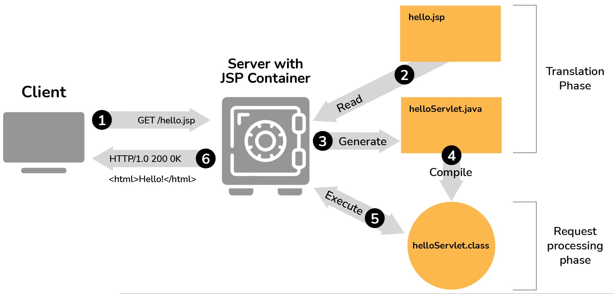

## <center>GUIA DE LABORATORIO N° 12<center>
>Intitución                 |Universidad Nacional del Centro del Perú   |
>-------------------------  | ------------------------------            |
>**Programa de Estudios:**  | Ingeniería de Sistemas                    |
>**Asignatura:**            | Desarrollo de Aplicaciones Web            |
>**Docente:**               | Jaime Suasnábar Terrel                    |
>**Semestre:**              | IX                                        |
### I. OBJETIVO
Desarrollar aplicaciones backend con el Lenguaje JSP.

### II. FUNDAMENTO TEÓRICO
#### ¿Qué es Jakarta Server Page?
El JSP es Java Server Pages es un lenguaje script del lado del servidor que permite la creación de un método dinámico independiente de la plataforma para construir aplicaciones Web. JSP tiene acceso a toda la familia de las API de Java, incluyendo la API JDBC para acceder a bases de datos. 



* Información de Jakarta y JSP
[Link de Jakarta:] (https://jakarta.ee/) 
[Jakarta Server Pages:] (https://jakarta.ee/specifications/pages/3.0/) 

#### Elementos JSP
##### Scriptlet
Un scriptlet puede contener cualquier número de declaraciones de JAVA, declaraciones variables, de métodos, o expresiones que sean válidas en el lenguaje de scripting de la página.
* Sintaxis
```js
<% code fragment %>
```
Puedes escribir el equivalente XML de la sintaxis anterior de la siguiente manera.
```js
<jsp:scriptlet>
   code fragment
</jsp:scriptlet>
```
* Ejemplo:
```js
<%
         out.println("Hola desde JSP");
%>
```
##### Declaraciones del JSP
Una declaración declara una o más variables o métodos que puede utilizar en el código Java más adelante en el archivo JSP. Debe declarar la variable o el método antes de usarlo en el archivo JSP.

* Sintaxis
```js
<%! declaration; [ declaration; ]+ ... %>
```
Puedes escribir el equivalente XML de la sintaxis anterior de la siguiente manera.
```js
<jsp:declaration>
   code fragment
</jsp:declaration>
```
* Ejemplo:
```js
<%! int i = 0; %> 
<%! int a, b, c; %> 
<%! Circle a = new Circle(2.0); %>
```
##### JSP Expression
Un elemento de expresión de JSP contiene una expresión del lenguaje scripting que se evalúa, se convierte en elemento html, e insertada donde la expresión aparece en el archivo JSP.
* Sintaxis
```js
<%= expression %>
```
Puedes escribir el equivalente XML de la sintaxis anterior de la siguiente manera.
```js
<jsp:expression>
   expression
</jsp:expression>
```
* Ejemplo:
```js
<html> 
   <head><title>A Comment Test</title></head> 
   
   <body>
      <p>Today's date: 
<%= (new java.util.Date()).toLocaleString()%>
      </p>
   </body> 
</html>
```
### IV. EJERCICIOS DEL LABORATORIO
Los ejercicios deberán ser desarrollados con **JSP puro sin servlets ni spring** con la ultima versión de Tomcat 11 y JDK-24. En otras versiones se califica con 0.
#### Ejercicio 11.1
Desarrollar un formulario con nombre apellidos (input text) genero (input radio) pasatiempos: futbol, natación, lectura (input check) capturar los datos y mostrarlos en otro archivo jsp mediante el método get. 

#### Ejercicio 11.2
Desarrollar un formulario con nombre apellidos (input text) genero (input radio) pasatiempos: futbol, natación, lectura (input check) capturar los datos y mostrarlos en otro archivo jsp mediante el método post. 


#### Ejercicio 11.3
Declare un array multidimensional con los datos de 10 estudiantes y mostrarlos en un JSP que muestre una tabla estilizada con css. 

#### Ejercicio 11.4
Desarrolle un CRUD completo en JSP con una base de datos en MySQL utilizando JDBC para una tabla estudiante

### V. RESULTADOS
Los resultados serán publicados en el portafolio electrónico del estudiante.