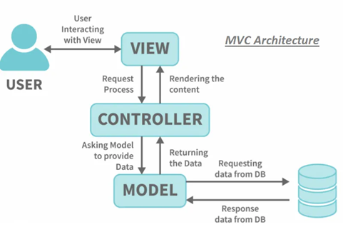
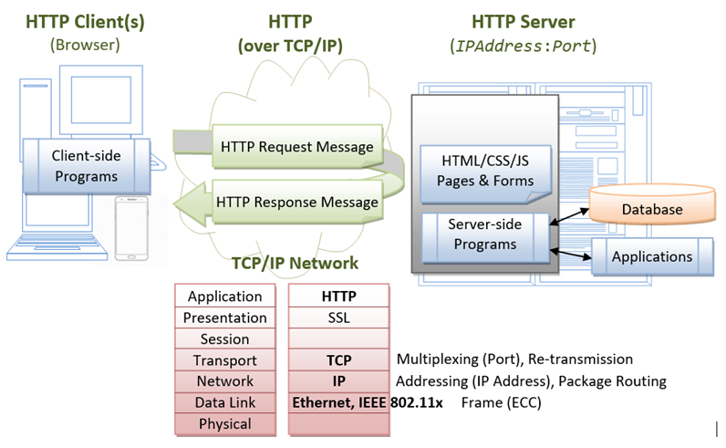

## <center>GUIA DE LABORATORIO N° 13<center>
>Intitución                 |Universidad Nacional del Centro del Perú   |
>-------------------------  | ------------------------------            |
>**Programa de Estudios:**  | Ingeniería de Sistemas                    |
>**Asignatura:**            | Desarrollo de Aplicaciones Web            |
>**Docente:**               | Jaime Suasnábar Terrel                    |
>**Semestre:**              | IX                                        |
### I. OBJETIVO
Desarrollar aplicaciones backend con el Lenguaje JSP.

### II. FUNDAMENTO TEÓRICO
#### Arquitectura MVC
Es una arquitectura que separa el desarrollo en capas: presentación (Vista), lógica (Controlador) y datos (Modelo). En esto, el flujo comienza desde la capa de vista, donde la solicitud se eleva y procesa en la capa del controlador. El origen de su aplicación es para la protección de directorios públicos del servidor inicialmente se realizaba a traves de archivos htaccess y htpasswd dando lugar a la aparición de sistema de rutas controladas.



* Información de Jakarta y Servlet
[Link de Jakarta:] (https://jakarta.ee/) 
[Jakarta Servlet:] (https://jakarta.ee/specifications/servlet/4.0/apidocs/) 
* El Modelo: 
Es la representación de la información con la cual el sistema opera, por tanto gestiona la persistencia mediante los privilegios de accesos, consultas, inserciones, actualizaciones, eliminaciones. Envía a la 'vista' aquella parte de la informació solicitada para que sea mostrada. Las peticiones de acceso o manipulación llegan a través del 'controlador'.
* El Controlador: 
Responde a eventos (acciones del usuario) e invoca peticiones al 'modelo' para editar un documento o un registro en la base de datos. También envia comandos a la 'vista' asociada a el 'modelo', por tanto, el 'controlador' es el intermediario entre la 'vista' y el 'modelo'.
* La Vista:
Presenta la información y la lógica del negocio en un formato interactivo (la interfaz de usuario), por tanto requiere del 'modelo' la información.

#### Servlet
El Servlet es una clase perteneciente a la clase Jakarta EE cuya función es recibir las peticiones REQUEST web de los clientes y contar con mecanismos que generen una respuesta RESPONSE. Los servlets son programas del lado del servidor (que se ejecutan dentro del contenedor de servlets de un servidor web)


#### Novedades del Servlet
*	Java EE 7 (28-05-2013): Java Servlet 3.1.
*	Java EE 8 (31/08/2017) / Jakarta EE 8 (10/09/2019): Jakarta Servlet 4.0.
*	Jakarta EE 9 (8 de diciembre de 2020): Jakarta Servlet 5.0 , ...
*	Jakarta EE 10 (13/09/2022): Jakarta Servlet 6.0 , ...
*	Jakarta EE 11 (2024?):


#### Ejemplo 1 - Desarrolle un servlet HelloServlet con el path "/hello" y que muestre los siguientes datos: Uri de la página, el protocolo utilizado, la ruta, Ip remoto y un número aleatorio.
```java
package org.suasnabar.webx01.servlet;

import java.io.*;
import jakarta.servlet.*;             // Tomcat 10
import jakarta.servlet.http.*;        // Tomcat 10
import jakarta.servlet.annotation.*;
import org.suasnabar.webx01.logic.Estudiante;

@WebServlet("/hello")
public class HelloServlet extends HttpServlet {

    @Override
    public void doGet(HttpServletRequest request, HttpServletResponse response)
            throws IOException, ServletException {

        response.setContentType("text/html; charset=UTF-8");
        PrintWriter out = response.getWriter(); 

        String html = "<!DOCTYPE html>\n" +
                "            <html>\n" +
                "            <head><title>Hello, World</title></head>\n" +
                "            <body>\n" +
                "              <h1>Hello, world!</h1>\n" +
                "              <p>Request URI: " + request.getRequestURI() + "</p>\n" +
                "              <p>Protocol: " + request.getProtocol() + "</p>\n" +
                "              <p>PathInfo: " + request.getPathInfo() + "</p>\n" +
                "              <p>Remote Address: " + request.getRemoteAddr() + "</p>\n" +
                "              <p>A Random Number: <strong>"+Math.random()+"</strong></p>\n" +
                "            </body>\n" +
                "            </html>\n";

        out.println(html);
        out.close();

        System.out.println("hello world, to Tomcat!");
    }
}

```
#### Ejemplo 2
form.jsp
```html
<%@page contentType="text/html" pageEncoding="UTF-8" %>
<!DOCTYPE html>
<html lang="en">
<head>
	<meta charset="UTF-8">
	<meta name="viewport" content="width=device-width, initial-scale=1.0">
	<title>Formulario jsp</title>
</head>
<body>
	<form action="servlet-form" method="get">
		<div>
			<label for="nombre">Nombre</label>
			<input type="text" name="nombre">
		</div>
		<div>
			<label for="direccion">Dirección</label>
			<input type="text" name="direccion">
		</div>
		<div>
			<label for="ciudad">Ciudad</label>
			<input type="text" name="ciudad">
		</div>
		<input type="submit" value="Enviar">
	</form>
	<form action="servlet-form" method="get">
		<input type="submit" value="Ver">
	</form>
</body>
</html>
```
ServletForm.java
```java
package org.suasnabar.webx01.servlet;
import jakarta.servlet.ServletException;
import jakarta.servlet.annotation.WebServlet;
import jakarta.servlet.http.HttpServlet;
import jakarta.servlet.http.HttpServletRequest;
import jakarta.servlet.http.HttpServletResponse;
import jakarta.servlet.http.HttpSession;
import org.suasnabar.webx01.logic.Estudiante;
import java.io.IOException;
import java.util.ArrayList;
import java.util.List;
@WebServlet("/servlet-form")
public class ServletForm extends HttpServlet {
    @Override
    protected void doGet(HttpServletRequest req, HttpServletResponse resp) throws ServletException, IOException {
        List<Estudiante> estudiantes = new ArrayList<>();
        estudiantes.add(new Estudiante("Jaime Suasnabar","lima 120", "Huancayo"));
        estudiantes.add(new Estudiante("Ada Marquez","Bolivar 450", "Arequipa"));
        estudiantes.add(new Estudiante("Juan Soto","Circunvalación 4542", "Lima"));
        estudiantes.add(new Estudiante("Andres Campos","La Marina 1542", "Lima"));
        HttpSession sesion = req.getSession();
        sesion.setAttribute("estudiantes", estudiantes);

        resp.sendRedirect("verform.jsp");
    }
}
```
verform.jsp
```html
<%@page import="java.util.List" %>
<%@page import="org.suasnabar.webx01.logic.Estudiante" %>
<%@page contentType="text/html" pageEncoding="UTF-8" %>
<!DOCTYPE html>
<html lang="es">
<head>
    <meta charset="UTF-8">
    <style>
        .tabla,td, th{
            border: 1px solid black;
        }
    </style>
    <title>Title</title>
</head>
<body>
    <h1>Lista de Estudiantes</h1>
    <table class="tabla">
        <tr>
            <th>Nombre</th>
            <th>Dirección</th>
            <th>Ciudad</th>
        </tr>
    <%
        List<Estudiante> estudiantes = (List) request.getSession().getAttribute("estudiantes");
        for(Estudiante estudiante: estudiantes){
     %>
        <tr>
            <td><%= estudiante.getNombre() %></td>
            <td><%= estudiante.getDireccion() %></td>
            <td><%= estudiante.getCiudad() %></td>
        </tr>
    <% 
        }
     %>
    </table>
</body>
</html>
```

### IV. EJERCICIOS DEL LABORATORIO
Los ejercicios deberán ser desarrollados con **JSP puro sin servlets ni spring** con la ultima versión de Tomcat 11 y JDK-24. En otras versiones se califica con 0.
#### Ejercicio 11.1
Desarrollar un formulario con nombre apellidos (input text) genero (input radio) pasatiempos: futbol, natación, lectura (input check) capturar los datos y mostrarlos en otro archivo jsp mediante el método get. 

#### Ejercicio 11.2
Desarrollar un formulario con nombre apellidos (input text) genero (input radio) pasatiempos: futbol, natación, lectura (input check) capturar los datos y mostrarlos en otro archivo jsp mediante el método post. 

#### Ejercicio 11.3
Declare un array multidimensional con los datos de 10 estudiantes y mostrarlos en un JSP que muestre una tabla estilizada con css. 

#### Ejercicio 11.4
Desarrolle un CRUD completo en JSP con una base de datos en MySQL utilizando JDBC para una tabla estudiante

### V. RESULTADOS
Los resultados serán publicados en el portafolio electrónico del estudiante.