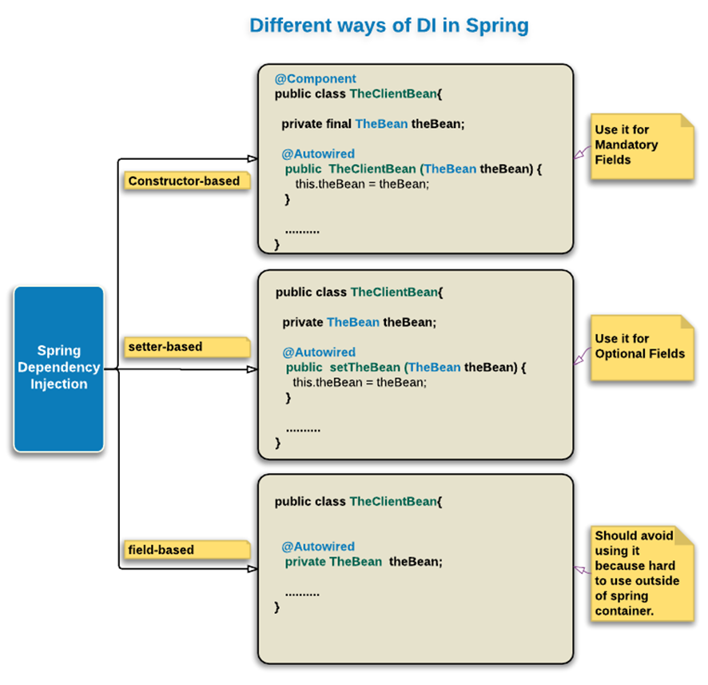

## <center>GUIA DE LABORATORIO N° 13<center>
>Intitución                 |Universidad Nacional del Centro del Perú   |
>-------------------------  | ------------------------------            |
>**Programa de Estudios:**  | Ingeniería de Sistemas                    |
>**Asignatura:**            | Desarrollo de Aplicaciones Web            |
>**Docente:**               | Jaime Suasnábar Terrel                    |
>**Semestre:**              | IX                                        |
### I. OBJETIVO
Desarrollar aplicaciones backend con el Lenguaje JSP.

### II. FUNDAMENTO TEÓRICO
#### Arquitectura MVC
Es una arquitectura que separa el desarrollo en capas: presentación (Vista), lógica (Controlador) y datos (Modelo). En esto, el flujo comienza desde la capa de vista, donde la solicitud se eleva y procesa en la capa del controlador. El origen de su aplicación es para la protección de directorios públicos del servidor inicialmente se realizaba a traves de archivos htaccess y htpasswd dando lugar a la aparición de sistema de rutas controladas.


* Información de Jakarta y Servlet
[Link de Jakarta:] (https://jakarta.ee/) 
[Jakarta Servlet:] (https://jakarta.ee/specifications/servlet/4.0/apidocs/) 
* El Modelo: 
Es la representación de la información con la cual el sistema opera, por tanto gestiona la persistencia mediante los privilegios de accesos, consultas, inserciones, actualizaciones, eliminaciones. Envía a la 'vista' aquella parte de la informació solicitada para que sea mostrada. Las peticiones de acceso o manipulación llegan a través del 'controlador'.
* El Controlador: 
Responde a eventos (acciones del usuario) e invoca peticiones al 'modelo' para editar un documento o un registro en la base de datos. También envia comandos a la 'vista' asociada a el 'modelo', por tanto, el 'controlador' es el intermediario entre la 'vista' y el 'modelo'.
* La Vista:
Presenta la información y la lógica del negocio en un formato interactivo (la interfaz de usuario), por tanto requiere del 'modelo' la información.

#### Servlet
El Servlet es una clase perteneciente a la clase Jakarta EE cuya función es recibir las peticiones REQUEST web de los clientes y contar con mecanismos que generen una respuesta RESPONSE. Los servlets son programas del lado del servidor (que se ejecutan dentro del contenedor de servlets de un servidor web)


#### Novedades del Servlet
*	Java EE 7 (28-05-2013): Java Servlet 3.1.
*	Java EE 8 (31/08/2017) / Jakarta EE 8 (10/09/2019): Jakarta Servlet 4.0.
*	Jakarta EE 9 (8 de diciembre de 2020): Jakarta Servlet 5.0 , ...
*	Jakarta EE 10 (13/09/2022): Jakarta Servlet 6.0 , ...
*	Jakarta EE 11 (2024?):


#### Ejemplo 1 - Desarrolle un servlet HelloServlet con el path "/hello" y que muestre los siguientes datos: Uri de la página, el protocolo utilizado, la ruta, Ip remoto y un número aleatorio.
```java
package org.suasnabar.webx01.servlet;

import java.io.*;
import jakarta.servlet.*;             // Tomcat 10
import jakarta.servlet.http.*;        // Tomcat 10
import jakarta.servlet.annotation.*;
import org.suasnabar.webx01.logic.Estudiante;

@WebServlet("/hello")
public class HelloServlet extends HttpServlet {

    @Override
    public void doGet(HttpServletRequest request, HttpServletResponse response)
            throws IOException, ServletException {

        response.setContentType("text/html; charset=UTF-8");
        PrintWriter out = response.getWriter(); 

        String html = "<!DOCTYPE html>\n" +
                "            <html>\n" +
                "            <head><title>Hello, World</title></head>\n" +
                "            <body>\n" +
                "              <h1>Hello, world!</h1>\n" +
                "              <p>Request URI: " + request.getRequestURI() + "</p>\n" +
                "              <p>Protocol: " + request.getProtocol() + "</p>\n" +
                "              <p>PathInfo: " + request.getPathInfo() + "</p>\n" +
                "              <p>Remote Address: " + request.getRemoteAddr() + "</p>\n" +
                "              <p>A Random Number: <strong>"+Math.random()+"</strong></p>\n" +
                "            </body>\n" +
                "            </html>\n";

        out.println(html);
        out.close();

        System.out.println("hello world, to Tomcat!");
    }
}

```
#### Ejemplo 2
form.jsp
```html
<%@page contentType="text/html" pageEncoding="UTF-8" %>
<!DOCTYPE html>
<html lang="en">
<head>
	<meta charset="UTF-8">
	<meta name="viewport" content="width=device-width, initial-scale=1.0">
	<title>Formulario jsp</title>
</head>
<body>
	<form action="servlet-form" method="get">
		<div>
			<label for="nombre">Nombre</label>
			<input type="text" name="nombre">
		</div>
		<div>
			<label for="direccion">Dirección</label>
			<input type="text" name="direccion">
		</div>
		<div>
			<label for="ciudad">Ciudad</label>
			<input type="text" name="ciudad">
		</div>
		<input type="submit" value="Enviar">
	</form>
	<form action="servlet-form" method="get">
		<input type="submit" value="Ver">
	</form>
</body>
</html>
```
ServletForm.java
```java
package org.suasnabar.webx01.servlet;
import jakarta.servlet.ServletException;
import jakarta.servlet.annotation.WebServlet;
import jakarta.servlet.http.HttpServlet;
import jakarta.servlet.http.HttpServletRequest;
import jakarta.servlet.http.HttpServletResponse;
import jakarta.servlet.http.HttpSession;
import org.suasnabar.webx01.logic.Estudiante;
import java.io.IOException;
import java.util.ArrayList;
import java.util.List;
@WebServlet("/servlet-form")
public class ServletForm extends HttpServlet {
    @Override
    protected void doGet(HttpServletRequest req, HttpServletResponse resp) throws ServletException, IOException {
        List<Estudiante> estudiantes = new ArrayList<>();
        estudiantes.add(new Estudiante("Jaime Suasnabar","lima 120", "Huancayo"));
        estudiantes.add(new Estudiante("Ada Marquez","Bolivar 450", "Arequipa"));
        estudiantes.add(new Estudiante("Juan Soto","Circunvalación 4542", "Lima"));
        estudiantes.add(new Estudiante("Andres Campos","La Marina 1542", "Lima"));
        HttpSession sesion = req.getSession();
        sesion.setAttribute("estudiantes", estudiantes);

        resp.sendRedirect("verform.jsp");
    }
}
```
verform.jsp
```html
<%@page import="java.util.List" %>
<%@page import="org.suasnabar.webx01.logic.Estudiante" %>
<%@page contentType="text/html" pageEncoding="UTF-8" %>
<!DOCTYPE html>
<html lang="es">
<head>
    <meta charset="UTF-8">
    <style>
        .tabla,td, th{
            border: 1px solid black;
        }
    </style>
    <title>Title</title>
</head>
<body>
    <h1>Lista de Estudiantes</h1>
    <table class="tabla">
        <tr>
            <th>Nombre</th>
            <th>Dirección</th>
            <th>Ciudad</th>
        </tr>
    <%
        List<Estudiante> estudiantes = (List) request.getSession().getAttribute("estudiantes");
        for(Estudiante estudiante: estudiantes){
     %>
        <tr>
            <td><%= estudiante.getNombre() %></td>
            <td><%= estudiante.getDireccion() %></td>
            <td><%= estudiante.getCiudad() %></td>
        </tr>
    <% 
        }
     %>
    </table>
</body>
</html>
```
#### SPRING FRAMEWORK

>El **Spring Framework** proporciona un modelo de programación y configuración completo para aplicaciones empresariales modernas basadas en Java, sobre cualquier tipo de plataforma de implementación. Integra los diferentes patrones de diseño en la programación.

>**Patron de Diseño: Inyección de dependencia (DI)**
La inyección de dependencia, es un tipo de inversion de control, donde el manejo de las propiedades de un objeto, son inyectadas a través de un constructor, un setter, un servicio, etc. Creando de esta manera un control diferente para un comportamiento más conveniente en nuestra aplicación.


#### MÓDULOS SPRING
Spring Framework comprende diversos módulos que proveen un rango de servicios:
* **Contenedor de inversión de control:**
Permite la administración del ciclo de vida de los objetos Java, se lleva a cabo principalmente a través de la inyección de dependencias.
* **Programación orientada a aspectos:**
Habilita la implementación de rutinas transversales.
* **Acceso a datos:**
Se trabaja con RDBMS en la plataforma java, usando Java Database Connectivity y herramientas de Mapeo objeto relacional con bases de datos NoSQL.
* **Gestión de transacciones:**
Unifica distintas APIs de gestión y coordina las transacciones para los objetos Java.
Modelo vista controlador: Un framework basado en HTTP y servlets, que provee herramientas para la extensión y personalización de aplicaciones web y servicios web REST.
* **Framework de acceso remoto:** 
Permite la importación y exportación estilo RPC, de objetos Java a través de redes que soporten RMI, CORBA y protocolos basados en HTTP incluyendo servicios web (SOAP).
* **Autenticación y Autorización:**
Procesos de seguridad configurables que soportan un rango de estándares, protocolos, herramientas y prácticas a través del subproyecto Spring Security (antiguamente Acegi).
* **Administración Remota:**
Configuración de visibilidad y gestión de objetos Java para la configuración local o remota vía JMX.
* **Mensajes:** 
Registro configurable de objetos receptores de mensajes, para el consumo transparente desde la a través de JMS, una mejora del envío de mensajes sobre las API JMS estándar.
* **Testing:** Soporte de clases para desarrollo de unidades de prueba e integración.
#### SPRING BOOT
Spring Boot es una herramienta que permite crear proyecto con Spring Framework, eliminando la complejidad de las configuraciones, instalación de dependencias además integrando un servidor de pruebas para desplegar la aplicación en desarrollo.

Ver [Documentación Spring Boot](https://spring.io/projects/spring-boot)
 
#### SERVICIOS API

>**¿Qué es un Servicio API?**
API es acrónimo de Interfaz de Programación de Aplicaciones (del inglés Application Programming Interface), es un conjunto de protocolos y definiciones que pueden permitir que una aplicación se comunique con la otra. El formato de intercambio de datos normalmente es JSON o XML.

>**¿Para qué necesitamos una API?**
*	Intercambio de información entre aplicaciones.
*	Proveer el servicio a las aplicaciones web
*	Proveer el servicio a las aplicaciones moviles

>**ENDPOINTS - API REST**
El conjunto de reglas API REST definen las operaciones CRUD (Create, Read, Update y Delete) se establecen a través de los:
ENDPOINT = METHOD HTTP + URL SEGMENT + QUERY PARAMS

>Descripción                |	Método	|   Segmento de URL |
>---------------------------|-----------|-------------------|
>Listar todos los clientes	|   GET	    |   /courses        |
>Obtener un solo cliente	|   GET	    |   /courses/{id}   |
>Crear u nuevo cliente	    |   POST	|   /courses        |
>Editar un cliente	        |   PUT	    |   /courses/{id}   |
>Borrar un cliente	        |   DELETE	|   /courses/{id}   |

> **Controllers**
```java
@RestController
public class Rutas {
    @GetMapping("/home")
    String home(){
        return "Desde ruta Home";
    }
    @GetMapping("/students")
    String student1(){
        return "Desde Student1 Hola";
    }
    @GetMapping("/students/{fname}")
    String student2(@PathVariable String fname){
        return "Desde Student2 Hola: "+fname;
    }
    @GetMapping("/student/{fname}/{lname}")
    String student3(@PathVariable String fname, @PathVariable String lname){
        return "Desde Student2 Hola: "+fname+" "+lname;
    }
    @GetMapping("/student/{name}")
    String student4(@PathVariable String name, @RequestParam int nota1, @RequestParam int nota2){
        return "Desde Student2 Hola: "+name+" tienes "+nota1+" y "+nota2;
    }
    @GetMapping("/studentsa")
    @ResponseStatus(value = HttpStatus.ACCEPTED)
    String student5(){
        return "Desde Student5 Status";
    }
    @GetMapping("/datajson/v2")
    public Map<String, Map<String, Object>> getProvinciaData(){
        return Map.of("Distrito", Map.of("id",1, "name", "El Tambo"));
    }
}
```
> **Models**
```java
@Entity
@Table(name = "students")
public class Student {
    @Id
    @GeneratedValue(strategy = GenerationType.AUTO)
    private Long id;
    private String name;
    private String address;
    private String city;
}    
```
### IV. EJERCICIOS DEL LABORATORIO
Los ejercicios **no entregables** deberán ser desarrollados con **Spring 3** con la ultima versión de Java 22. No se calificará.
#### Ejercicio 13.1
Desarrolle un controlador de API que compruebe que el id y nota de la ruta “/student/{id}/{nota}” son números. En caso de certeza mostrar un json que contiene el id, nota, un mensaje de ruta válida y el estado 202.
#### Ejercicio 13.2
Desarrolle un controlador de API con los id y notas según la siguiente ruta “/student/{id}?nota1=xx&nota2=xx&nota3=xx”. Que muestre un json que contiene el id, promedio, un mensaje de ruta válida y el estado 202.
#### Ejercicio 13.3
Diseñar y desarrolle una API REST para que devuelva datos desde una base de datos de 3 tablas departamento(id, name), provincia(id, name) y distrito(id, name).
#### Ejercicio 13.4
Diseñar y desarrolle una API REST para realizar las operaciones CRUD desde y hacia una base de datos de 3 tablas departamento(id, name), provincia(id, name) y distrito(id, name).


### V. RESULTADOS
Los resultados serán publicados en el portafolio electrónico del estudiante.